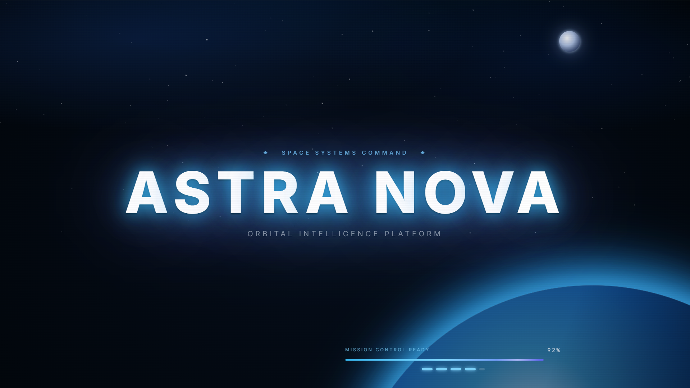
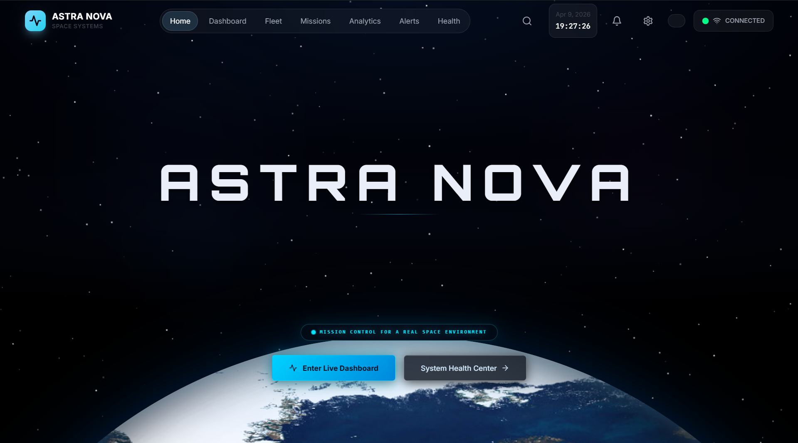
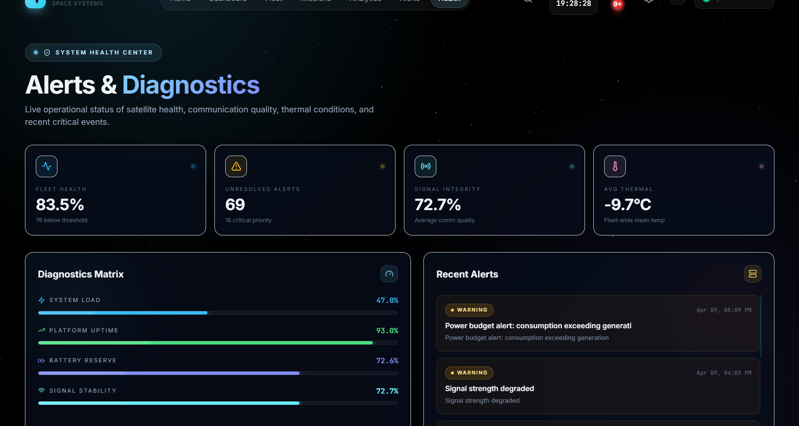

# ASTRA-NOVA

**AI-Powered Real-Time Satellite Health Monitoring & Collision Prevention System**

Real-time 3D satellite tracking and space debris monitoring system with intelligent collision detection, mission planning, and live telemetry visualization.



## Features

### Core Capabilities
- **Real-time 3D Earth Visualization** - Interactive globe rendering satellites and debris in 3D space
- **Satellite Fleet Tracking** - Monitor thousands of satellites with live TLE propagation
- **Collision Detection & Alerts** - AI-powered risk assessment and proximity warnings
- **Debris Monitoring** - Track orbital debris and predict close approaches
- **Mission Planning** - Plan and simulate satellite maneuvers
- **Live Telemetry Dashboard** - Real-time health metrics and system diagnostics
- **Analytics & Reporting** - Generate PDF reports and export telemetry data

### Technical Highlights
- Propagates satellite positions using SGP4 orbital mechanics
- Real-time proximity analysis between all tracked objects
- Alert severity classification (critical, warning, info)
- System health monitoring with uptime tracking
- Historical telemetry data storage

## Tech Stack

### Frontend
- **React 18** - UI framework with hooks and state management
- **Vite** - Fast build tool and dev server
- **Three.js / React Three Fiber** - 3D rendering and visualization
- **Framer Motion** - Smooth animations and transitions
- **Tailwind CSS** - Utility-first styling
- **Leaflet** - 2D map integration
- **satellite.js** - JavaScript satellite library
- **jspdf** - PDF report generation
- **lucide-react** - Icon library

### Backend
- **Node.js** - JavaScript runtime
- **Express** - Web framework
- **better-sqlite3** - SQLite database
- **satellite.js** - Satellite position propagation
- **CORS** - Cross-origin resource sharing
- **dotenv** - Environment variables

### Data Sources
- CelesTrak TLE data
- N2YO satellite API
- Custom JSON/TLE imports

## Project Structure

```
ASTRA-NOVA/
├── src/
│   ├── components/          # React components
│   │   ├── Dashboard3D.jsx  # 3D Earth dashboard
│   │   ├── Earth3D.jsx     # 3D Earth renderer
│   │   ├── SatelliteFleet.jsx
│   │   ├── MissionControl.jsx
│   │   ├── AlertsHub.jsx
│   │   ├── Analytics.jsx
│   │   ├── SystemHealthCenter.jsx
│   │   └── ...
│   ├── hooks/               # Custom React hooks
│   │   ├── useTelemetry.jsx
│   │   ├── useCollisionDetection.jsx
│   │   ├── useDebrisDetection.jsx
│   │   └── useBackendData.jsx
│   ├── simulation/         # Mission simulation
│   ├── utils/              # Utility functions
│   │   ├── collisionCalculator.js
│   │   ├── pdfGenerator.js
│   │   └── openrouter.js
│   ├── App.jsx             # Main app component
│   ├── main.jsx            # Entry point
│   └── index.css           # Global styles
├── backend/
│   ├── src/
│   │   ├── server/         # Express server
│   │   └── database/       # SQLite schema
│   ├── scripts/           # Data import scripts
│   ├── data/              # SQLite database
│   └── package.json
├── public/
│   └── catalog.json        # Satellite catalog
├── screenshots/           # Documentation images
├── package.json
├── vite.config.js
├── tailwind.config.js
└── postcss.config.js
```

## Screenshots

| Home Dashboard | Earth View | Alerts |
|----------------|------------|---------|
|  |  |  |

| Satellite Fleet |
|----------------|
|  |

## Installation & Setup

### Prerequisites
- Node.js 18+
- npm or yarn

### Steps

```bash
# Clone the repository
git clone https://github.com/Darshanv2006/ASTRA-NOVA.git

# Navigate into project folder
cd ASTRA-NOVA

# Install frontend dependencies
npm install --legacy-peer-deps

# Install backend dependencies
cd backend
npm install
cd ..

# Start the backend server (in one terminal)
cd backend
npm run dev

# Start the frontend (in another terminal)
npm run dev
```

### Configuration

Create a `.env` file in the root directory:

```env
VITE_BACKEND_URL=http://localhost:3002
```

Create a `.env` file in the backend directory (copy from `.env.example`):

```env
PORT=3002
BACKEND_URL=http://localhost:3002
```

### Access

- Frontend: http://localhost:5173
- Backend API: http://localhost:3002

## API Endpoints

| Endpoint | Method | Description |
|----------|--------|-------------|
| `/api/satellites` | GET | Get all satellites |
| `/api/satellites/:id` | GET | Get satellite by ID |
| `/api/satellites/:id/telemetry` | GET | Get satellite telemetry |
| `/api/satellites/:id/positions` | GET | Get satellite position history |
| `/api/satellites/:id/missions` | GET | Get satellite missions |
| `/api/satellites/:id/ground-track` | GET | Get ground track coordinates |
| `/api/satellites/:id/passes` | GET | Get visible pass predictions |
| `/api/satellites/positions/batch` | GET | Batch position updates |
| `/api/agencies` | GET | Get space agencies |
| `/api/alerts` | GET | Get alerts |
| `/api/alerts` | POST | Create new alert |
| `/api/missions` | GET | Get all missions |
| `/api/missions` | POST | Create new mission |
| `/api/telemetry-history` | GET | Get telemetry history |
| `/api/positions/last-30min` | GET | Get positions from last 30 minutes |
| `/api/debris` | GET | Get debris objects |
| `/api/health` | GET | System health check |

## Scripts

### Import Satellite Data

```bash
# Import from CelesTrak
cd backend
node scripts/import-celestrak.js

# Import from N2YO
node scripts/import-tle-n2yo.js

# Import custom JSON
node scripts/import-json-tle.js your-file.json

# Import all CelesTrak categories
node scripts/import-all-celestrak.js
```

### Update Satellite Positions

```bash
node scripts/update-positions.js
```

## Contributing

Contributions are welcome! Feel free to fork the repository and submit a pull request.

1. Fork the repo
2. Create your feature branch (`git checkout -b feature/amazing-feature`)
3. Commit your changes (`git commit -m 'Add amazing feature'`)
4. Push to the branch (`git push origin feature/amazing-feature`)
5. Open a Pull Request

## License

MIT License - see [LICENSE](./LICENSE) for details.

## Author

**Darshan V**
- GitHub: [@Darshanv2006](https://github.com/Darshanv2006)

## Acknowledgments

- [CelesTrak](https://celestrak.org/) - Satellite tracking data
- [satellite.js](https://github.com/shashwatak/satellite.js) - SGP4 implementation
- [Three.js](https://threejs.org/) - 3D graphics
- All contributors and supporters

---

If you find this project useful, please give it a star!
