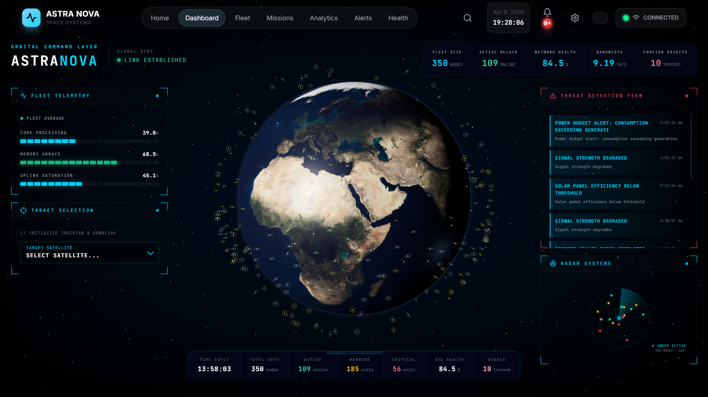
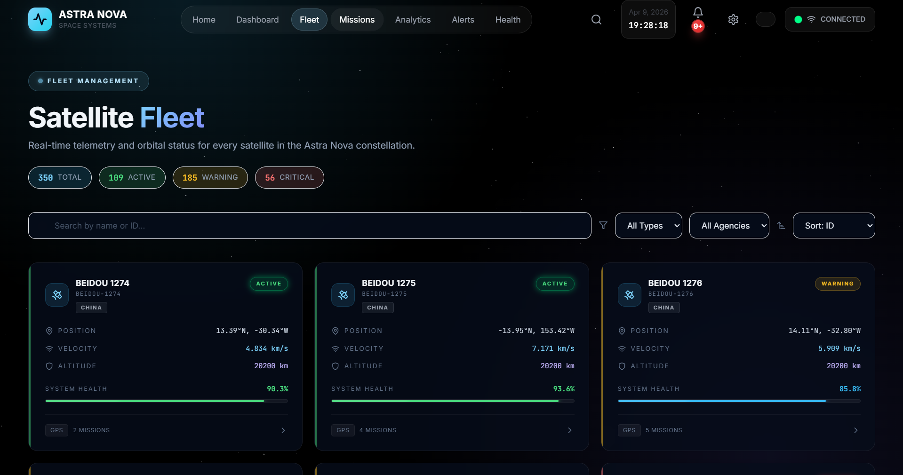

# ASTRA-NOVA
Real-time 3D satellite tracking &amp; debris monitoring system with collision detection, mission planning, and live telemetry visualization.

# 🚀 ASTRA-NOVA

<p align="center">
  
</p>

<p align="center">
  🌍 Real-time 3D Satellite Tracking & Space Debris Monitoring System
</p>

---

## ✨ Features

* 🌍 Real-time 3D Earth visualization
* 🛰️ Satellite tracking system
* 🚨 Collision detection & alerts
* 📊 Telemetry dashboard
* 📡 Live data monitoring
* ⚡ Fast and interactive UI

---

## 🛠️ Tech Stack

* ⚛️ React + Vite
* 🌐 Three.js / React Three Fiber
* 📡 Node.js (Backend)
* 🛰️ Satellite APIs
* 🎨 Modern UI

---

## 📸 Screenshots

### 🏠 Home


### 🌍 Earth Dashboard



### 🚨 Alerts & Diagnostics


### 🛰️ Satellite Fleet



---

## 🚀 Installation & Setup

```bash
# Clone the repository
git clone https://github.com/Darshanv2006/ASTRA-NOVA.git

# Navigate into project folder
cd ASTRA-NOVA

# Install dependencies (important)
npm install --legacy-peer-deps

# Start development server
npm run dev
```

👉 Open in browser: http://localhost:5173

---

## 📂 Project Structure

```
ASTRA-NOVA/
├── src/
├── public/
├── backend/
├── screenshots/
├── README.md
├── LICENSE
```

---

## 🌍 Live Demo

🚀 Coming Soon...

---

## 🤝 Contributing

Contributions are welcome!
Feel free to fork the repository and submit a pull request.

---

## 📜 License

This project is licensed under the [MIT License](LICENSE).

---

## 👨‍💻 Author

**Darshan V**

---

⭐ If you like this project, give it a star!
